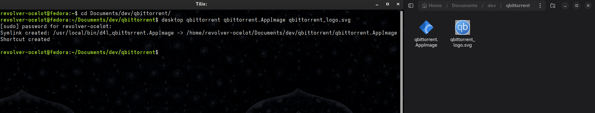
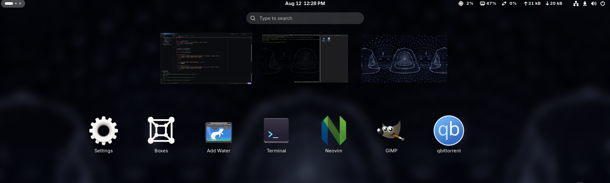

# Small script for easy ".desktop" files.

This script was made to facilitate the steps of creating .desktop files for Linux

### Instalation

```bash
git clone https://github.com/BrunoOfAstora/easy.desktop4linux.git

cd easy.desktop4linux

./install.sh
````

### Usage
````bash
desktop <name> <executable> <icon>
````
> [!IMPORTANT]
> 
> 1 - If the 'desktop' command is not working, try to reopen your shell
> 
> 2 - the 'name' must be the name that you want to give to your app
> 
> 3- the 'executable' must be the file that you want execute
> 
> 4 - the 'icon' is the "thumbnail" of your app

## Example
### Step 1:


### Step 2 (Done):
